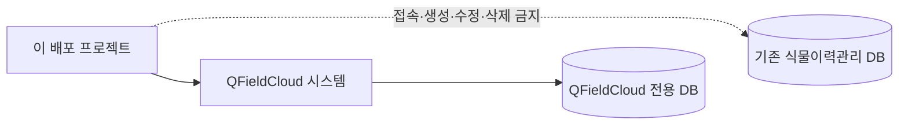

# QFieldCloud AWS Self-Hosting

> [!IMPORTANT]
> 이 저장소는 QFieldCloud를 AWS에 배포하기 위한 **독립적인 비공식 프로젝트**입니다. OPENGIS.ch의 공식 제품, 공식 설치 프로그램 또는 공식 지원 프로젝트가 아니며, OPENGIS.ch의 보증이나 지원을 받지 않습니다.

AWS(Amazon Web Services)를 처음 사용하는 사람도 검토 가능한 방식으로 QFieldCloud를 구축할 수 있게 만드는 프로젝트입니다. 수목원 식물이력관리는 활용 사례 중 하나이며, 자동화 도구 자체는 다른 기관도 재사용할 수 있도록 설계합니다.

## 현재 구현 상태

확인 기준일은 **2026-08-23**입니다.

- `lab-lightsail` 파일럿의 CloudFormation 템플릿, 배포 전 확인 도구, Docker Compose, 설치·상태·worker 시험·백업·격리 복원시험 도구가 구현되어 있습니다.
- 비루트 관리자가 배포 역할과 권한 상한선을 만들고, 별도의 설치자가 접근키 없이 1시간 역할 세션으로 설치하는 흐름을 구현했습니다. 템플릿 문법과 로컬 계약은 검증했지만 새 계정의 실제 역할 전환 종단 간 시험은 아직 완료하지 않았습니다.
- QFieldCloud는 공식 릴리스 `v26.25`, Git commit(정확한 소스 저장 시점)과 `linux/amd64` 컨테이너 digest(이미지 내용 고유 식별자)로 고정합니다.
- QGIS 3 worker만 허용합니다. 공식 `v26.25` QGIS 4 이미지의 내용이 기대와 달라 QGIS 4는 안전하게 실패하도록 비활성화했습니다.
- **실제 AWS에서 두 번의 생성 실패를 재현했고, 두 번째 원인을 공식 DH parameters checksum 오기입으로 확정해 수정했지만 최신 수정안 재배포는 아직 검증하지 않았습니다.** 문서의 명령이 실제 AWS 설치 성공을 보장한다는 뜻이 아닙니다.
- `standard-aws`는 아직 Phase 1 설계 단계이며 실행 가능한 배포 도구가 없습니다.

처음 설치를 검토한다면 [lab-lightsail 파일럿 안내서](docs/lab-lightsail.md)를 먼저 읽으세요. 배포 명령은 기본적으로 계획만 확인하고, 사용자가 `-Execute`를 명시해야 자원을 만듭니다.

## `lab-lightsail` 한눈에 보기

| 항목 | 현재 파일럿 |
|---|---|
| 리전 | 서울 `ap-northeast-2`만 허용 |
| 서버 | Lightsail Linux 4GB RAM, 2 vCPU, 80GB SSD 한 대 |
| 서버 안 구성 | QFieldCloud app·Nginx·worker, 전용 PostGIS, 로컬 S3 호환 저장소 |
| 접속 | 고정 IPv4 기반 `IP.sslip.io`, 자체서명 TLS 인증서 |
| 백업 | 자동 snapshot 기본 사용, 최초 애플리케이션 백업·격리 복원시험은 설치 중 자동 실행, 이후 백업은 서버 로컬 디스크에 수동 생성 |
| 삭제 보호 | 생성 시작부터 CloudFormation termination protection(삭제 방지) 활성화 |
| 월 비용 추정 | 인스턴스만 약 **US$24** + 실제 자동 snapshot 저장량, snapshot 7개를 모두 80GB 완전 변경으로 계산한 보수적 상한 약 **US$52** |
| 용도 | 학습·내부 시험·소규모 파일럿 |

세금, 환율, 전송량 초과, 수동 snapshot과 사용자가 별도로 만든 자원은 포함하지 않습니다. 가격은 바뀔 수 있으므로 실행 직전에 [AWS Lightsail 가격표](https://aws.amazon.com/lightsail/pricing/)를 다시 확인해야 합니다.

> [!WARNING]
> 이 구성은 한 서버에 앱, DB, 객체 저장소와 백업을 모은 **단일 장애점**입니다. 서버 한 대가 고장 나거나 삭제되면 전체 서비스와 로컬 백업을 함께 잃을 수 있습니다. worker가 사용하는 Docker socket은 호스트 관리자 권한에 가까운 위험도 가집니다. 중요 업무나 공개 운영용으로 보장하지 않습니다.

## 반드시 지키는 경계

- 이 배포기는 기존 식물이력관리 PostgreSQL/PostGIS DB의 주소나 인증정보를 요구하지 않으며 해당 DB에 접속·생성·수정·삭제하지 않습니다.
- QFieldCloud 시스템 DB와 기존 식물이력관리 DB는 서로 완전히 별개의 시스템입니다.
- 비밀번호와 암호화 키는 인스턴스 안에서 생성하고 GitHub, CloudFormation 출력 또는 설치 로그에 넣지 않습니다.
- AWS 루트 사용자와 장기 접근키를 설치 편의 수단으로 사용하지 않습니다. 기존 조직은 IAM Identity Center를, 단독 무료 계정은 콘솔 전용 IAM 사용자와 `aws login` 임시 브라우저 자격증명을 사용합니다.
- 계정 관리자는 [배포 권한 준비](docs/access-bootstrap.md)에서 설치자 신뢰 주체를 등록합니다. 이후 별도 설치자는 고정된 최소 권한 역할의 **각 세션을 최대 1시간** 사용합니다. 원본 브라우저 로그인은 더 오래 유효할 수 있고 새 1시간 세션을 다시 받을 수 있으므로, 작업 후 원본 프로필에서도 로그아웃해야 합니다. 한 사람이 관리자 프로필을 그대로 재사용하는 간편 경로는 가능하지만 관리자 권한 자체가 사라지는 것은 아닙니다.
- `latest`, `main` 같은 변동 참조로 운영 이미지를 바꾸지 않습니다. 업데이트는 백업·검토·명시적 버전 변경을 거치는 별도 작업입니다.
- 비용이 발생하는 실제 AWS 시험은 사용자가 비용, 위험과 삭제 방법을 확인한 뒤에만 실행합니다.

## 데이터베이스 분리 원칙

사용자가 나중에 QGIS 프로젝트에서 기존 DB를 별도 데이터 소스로 연결하는 일은 이 배포와 다른 작업이며, 별도의 승인과 보안 검토가 필요합니다.

## 두 배포 프로필

| 항목 | `lab-lightsail` | `standard-aws` |
|---|---|---|
| 상태 | 파일럿 구현, 두 번째 AWS 실패 수정 후 최신 재배포 전 | 설계 문서만 있음 |
| 목적 | 학습·내부 시험·소규모 검증 | 장기 운영·확장·다른 기관 배포 |
| 컴퓨팅 | Lightsail 한 대 | EC2 한 대 이상 |
| 시스템 DB | 같은 서버의 전용 PostgreSQL/PostGIS | 별도 RDS PostgreSQL/PostGIS |
| 객체 저장소 | 같은 서버의 로컬 S3 호환 저장소 | S3 및 Versioning |
| 장애 영향 | 서버 한 대 장애 시 전체 중단 | 서비스별 장애 격리 가능 |

`lab-lightsail`의 4GB RAM, 2 vCPU, swap 4GB, worker 1개는 공식 최소사양이 아니라 **초기 시험 가정**입니다. 적정 크기는 실제 시험 프로젝트로 측정해야 합니다.

## 문서 지도

| 문서 | 역할 |
|---|---|
| [lab-lightsail 파일럿 안내서](docs/lab-lightsail.md) | 현재 구현의 계획, 설치, 확인, 백업, 복원시험과 삭제 |
| [배포 권한 준비와 유지관리](docs/access-bootstrap.md) | 관리자 설정, 설치자 분리, 역할 기반 설치·갱신·제거 흐름 |
| [아키텍처](docs/architecture.md) | 두 프로필의 구성과 데이터 경계 |
| [비용](docs/costs.md) | Phase 1 비용 설계와 비용 증가 요인 |
| [보안 모델](docs/security-model.md) | 인증정보, Docker socket과 네트워크 위험 |
| [버전 정책](docs/version-policy.md) | 공식 릴리스·commit·이미지 digest 고정 방식 |
| [라이선스와 상표](docs/trademarks-and-licenses.md) | 재배포 고지와 비공식 프로젝트 표시 |
| [문제 해결](docs/troubleshooting.md) | 안전한 진단 순서 |
| [Phase 1 운영 실행서](docs/runbooks/) | 자동화 구현 전 정한 설계 기준 |
| [보안 정책](SECURITY.md) | 취약점 신고와 민감정보 취급 |
| [고지](NOTICE.md) | QFieldCloud와 이 프로젝트의 관계 |

Phase 1 실행서는 안전 기준을 기록한 설계 문서입니다. 현재 `lab-lightsail`의 정확한 명령과 구현 범위는 새 파일럿 안내서를 우선합니다.

## 공식 자료

- [QFieldCloud 공식 저장소](https://github.com/opengisch/QFieldCloud)
- [QFieldCloud `v26.25` 공식 릴리스](https://github.com/opengisch/QFieldCloud/releases/tag/v26.25)
- [QFieldCloud self-hosting 공식 문서](https://docs.qfield.org/reference/qfieldcloud/self_hosted/)
- [QFieldCloud 공식 아키텍처](https://docs.qfield.org/reference/qfieldcloud/architecture/)
- [AWS CloudFormation 공식 문서](https://docs.aws.amazon.com/cloudformation/)
- [AWS Lightsail 가격](https://aws.amazon.com/lightsail/pricing/)
