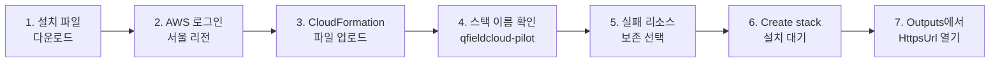

# QFieldCloud AWS 간편 설치

> 이 저장소는 QField 또는 QFieldCloud 공식 프로젝트가 아닌 독립적인 비공식 배포 자동화 프로젝트입니다.

[](https://raw.githubusercontent.com/jusubkim94/qfieldcloud-self-hosting-for-arboreta/e7b77390a0822415a96bc496aa841be352e5f3fa/releases/lab-lightsail/v0.1.0/qfieldcloud-lab-lightsail-v0.1.0.zip)

위 버튼으로 ZIP 파일을 내려받아 압축을 풀고, 안에 있는 `template.yaml`을 AWS CloudFormation 화면에 올리면 됩니다. Git, PowerShell, AWS CLI, Access Key 또는 별도 IAM 사용자 생성은 필요하지 않습니다.

## 설정을 바꾸고 싶다면

[](https://raw.githubusercontent.com/jusubkim94/qfieldcloud-self-hosting-for-arboreta/0d23bbcbbcb421f840b39029727583cdbbae41de/releases/tools/qfieldcloud-template-editor/v0.1.0/QFieldCloudTemplateEditor-v0.1.0.exe)

Windows 사용자는 위 EXE를 내려받아 Region, Availability Zone, 인스턴스 이름, Lightsail 사양, OS, HTTPS 인증서 방식, 설치 대기시간과 상태 Alarm 기준을 화면에서 바꿀 수 있습니다. 모든 내용을 직접 바꾸는 YAML 원문 편집기도 포함합니다.

1. `QFieldCloudTemplateEditor-v0.1.0.exe`를 실행합니다.
2. **설정 편집**에서 값을 선택하고 **적용 후 검증**을 누릅니다.
3. 오류가 없으면 **파일 → 다른 이름으로 저장**으로 새 `template.yaml`을 저장합니다.
4. 아래 설치 순서에서 ZIP의 파일 대신 방금 저장한 YAML을 올립니다.

앱은 AWS에 접속하거나 Access Key를 요구하지 않습니다. 코드 서명이 없어 Windows SmartScreen 경고가 나타날 수 있습니다. EXE SHA-256은 `2163cdbd58ab8cc14e39a263a3b8830c8d975c1a7c4c2b7eada6d8184f59d33f`입니다.

standalone 서버 node 수는 1로 고정됩니다. 여러 node는 YAML 한 항목이 아니라 Load Balancer, 공유 RDS/PostGIS와 S3가 필요한 별도 `standard-aws` 아키텍처입니다. 앱 안의 **Standalone 구조**와 **전체 설치 과정** 탭에서 한국어 다이어그램과 설명을 볼 수 있습니다.

## 설치 순서



1. 위의 초록색 **설치 파일 다운로드** 버튼을 누르고, 받은 ZIP 파일의 압축을 풉니다.
2. [AWS 웹 콘솔](https://console.aws.amazon.com/)에 로그인하고 오른쪽 위 리전을 **서울 `ap-northeast-2`**로 바꿉니다.
3. **CloudFormation → Stacks → Create stack → With new resources (standard)**를 누릅니다.
4. **Choose an existing template → Upload a template file → Choose file**을 누르고 압축을 풀어 나온 `template.yaml`을 선택합니다.
5. **Next**를 누르고 스택 이름을 `qfieldcloud-pilot`로 입력합니다.
6. 다음 화면의 **Configure stack options → Stack failure options**에서 **Preserve successfully provisioned resources**를 선택한 뒤 마지막 화면에서 **Submit**을 누릅니다.
7. 최대 150분 동안 기다립니다. 상태가 `CREATE_COMPLETE`가 되면 **Outputs → HttpsUrl**을 열어 접속합니다.

`Preserve successfully provisioned resources`는 YAML 속성이 아니라 CloudFormation의 스택 생성 실행 옵션이므로 템플릿이 자동 선택할 수 없습니다. 이 옵션을 선택하면 설치 실패 시 진단 로그가 있는 Lightsail이 남지만, 스택을 삭제할 때까지 서버와 분리된 Static IP 비용이 계속 발생할 수 있습니다.

> [!CAUTION]
> 기본 서버 비용은 서울 Linux 4GB Lightsail 기준 월 최대 **US$24**입니다. 이 파일럿에는 백업·복원·자동 snapshot이 없습니다. 스택이나 서버를 삭제하면 데이터를 복구할 수 없습니다.

> [!WARNING]
> AWS 루트 사용자도 차단하지 않지만 가능한 한 MFA(다중 인증)가 설정된 관리자 계정을 사용하세요. 루트 Access Key는 만들지 마세요. 기본 HTTPS 인증서는 자체서명 방식이라 처음 접속할 때 브라우저 경고가 표시됩니다.

## 관리자 계정 확인

1. AWS 콘솔에서 **Lightsail → Instances → qfieldcloud-pilot**을 엽니다.
2. **Connect using SSH**를 누릅니다.
3. 브라우저 터미널에 다음 한 줄을 붙여넣습니다.

```bash
sudo /opt/qfieldcloud/bin/show-admin-credentials.sh
```

표시된 비밀번호를 채팅, 파일, GitHub 이슈 또는 로그에 붙여넣지 마세요.

## 삭제해서 비용 멈추기

1. AWS 콘솔 오른쪽 위 리전이 **서울**인지 확인합니다.
2. **CloudFormation → Stacks → qfieldcloud-pilot**을 선택합니다.
3. **Delete → Delete stack**을 누르고 `DELETE_COMPLETE`까지 확인합니다.
4. **Lightsail**에서 인스턴스와 고정 IP가 남지 않았는지 확인하고 **Billing and Cost Management**에서 비용 중단을 확인합니다.

삭제하면 QFieldCloud 데이터가 영구적으로 사라집니다. 오류가 나면 [상세 삭제 안내](docs/runbooks/uninstall.md)를 따르세요.

## 내려받는 파일은 무엇인가요?

- 다운로드용 ZIP: [`qfieldcloud-lab-lightsail-v0.1.0.zip`](releases/lab-lightsail/v0.1.0/qfieldcloud-lab-lightsail-v0.1.0.zip)
- ZIP 안의 배포 파일: [`template.yaml`](releases/lab-lightsail/v0.1.0/template.yaml)
- 릴리스 정보: [`manifest.json`](releases/lab-lightsail/v0.1.0/manifest.json)
- 무결성 값: [`SHA256SUMS`](releases/lab-lightsail/v0.1.0/SHA256SUMS)
- Template SHA-256: `506c2c77bcd0c50907c28777151a7256f5541b45c4d66ec7cee0a5164e4fc539`
- 고정된 설치 소스: `094c0662364ab96d6523bd1a2fbdf7e012d16948`

저장소의 [`infra/lab-lightsail/template.yaml`](infra/lab-lightsail/template.yaml)은 릴리스 파일을 만드는 원본 틀이므로 직접 업로드하지 마세요. 사용자는 위 다운로드 버튼의 완성 파일만 사용합니다.

CloudFormation 콘솔은 업로드한 파일을 사용자 AWS 계정의 내부 S3 업로드 버킷에 보관할 수 있습니다. 사용자가 공개 S3 버킷이나 공개 정책을 만들 필요는 없습니다.

## 현재 검증 범위

- CloudFormation 문법, Bash·PowerShell 문법, 고정 이미지 digest, Secret 패턴과 문서 링크는 로컬 정적 검사로 확인했습니다.
- 2026-08-24에 `v0.1.0` 수동 업로드 생성을 실제 AWS에서 시도했으나 `create_project` worker 검증이 실패하여 스택이 롤백되었습니다. 생성부터 `CREATE_COMPLETE`와 삭제까지의 성공 종단 간 시험은 아직 완료하지 못했습니다.
- `medium_3_0` 상품과 `ap-northeast-2a`의 현재 계정별 가용성은 생성 시점에 달라질 수 있습니다.
- 기존 식물이력관리용 PostGIS 데이터베이스에는 연결하거나 변경하지 않습니다.

<details>
<summary>기술 문서 보기</summary>

- [lab-lightsail 상세 안내](docs/lab-lightsail.md)
- [설치 실행서](docs/runbooks/install.md)
- [상태 확인](docs/runbooks/status.md)
- [비용](docs/costs.md)
- [보안 모델](docs/security-model.md)
- [버전 정책](docs/version-policy.md)
- [릴리스 생성과 선택적 S3 게시](docs/release-publishing.md)
- [Windows GUI 편집기 소스와 빌드](tools/qfieldcloud-template-editor/README.md)
- [상표·라이선스](docs/trademarks-and-licenses.md)

</details>
