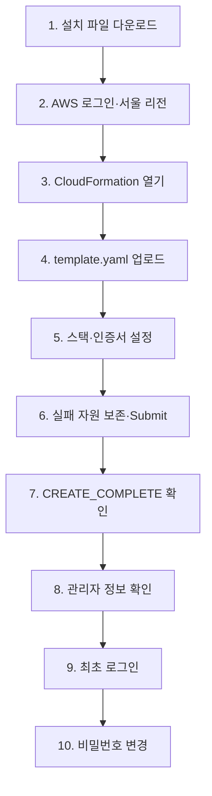

# QFieldCloud AWS 간편 설치

> 이 저장소는 QField 또는 QFieldCloud 공식 프로젝트가 아닌 독립적인 비공식 배포 자동화 프로젝트입니다.

[](https://raw.githubusercontent.com/jusubkim94/qfieldcloud-self-hosting-for-arboreta/ef444f600e8746286a5a0adeaf718aa40e06a33a/releases/lab-lightsail/v0.1.4/qfieldcloud-lab-lightsail-v0.1.4.zip)

위 버튼으로 ZIP 파일을 내려받아 압축을 풀고, 안에 있는 `template.yaml`을 AWS CloudFormation 화면에 올리면 됩니다. Git, PowerShell, AWS CLI, Access Key 또는 별도 IAM 사용자 생성은 필요하지 않습니다.

## 시작 전에 꼭 확인

> [!CAUTION]
> 기본 서버 비용은 서울 Linux 4GB Lightsail 기준 월 최대 **US$24**입니다. 이 파일럿에는 백업·복원·자동 snapshot이 없습니다. 스택이나 서버를 삭제하면 데이터를 복구할 수 없습니다.

> [!WARNING]
> AWS 루트 사용자도 차단하지 않지만 가능한 한 MFA(다중 인증)가 설정된 관리자 계정을 사용하세요. 루트 Access Key는 만들지 마세요. 기본 HTTPS는 Let’s Encrypt 공인 IP 인증서를 사용하며 외부 인증기관, 공개 HTTP 80 도달 가능성과 발급 제한에 의존합니다. 약관 동의는 자동 선택되지 않습니다.

## 처음 설치하고 로그인하기



1. 위의 초록색 **설치 파일 다운로드** 버튼을 누르고, 받은 ZIP 파일의 압축을 풉니다.
2. [AWS 웹 콘솔](https://console.aws.amazon.com/)에 로그인하고 오른쪽 위 리전을 **서울 `ap-northeast-2`**로 바꿉니다.
3. **CloudFormation → Stacks → Create stack → With new resources (standard)**를 누릅니다.
4. **Choose an existing template → Upload a template file → Choose file**을 누르고 압축을 풀어 나온 `template.yaml`을 선택합니다.
5. **Next**를 누르고 스택 이름을 `qfieldcloud-pilot`로 입력합니다. 파라미터에서 `CertificateMode`가 기본 `letsencrypt-ip`인지 확인하고, [현재 Subscriber Agreement](https://letsencrypt.org/repository/)를 읽은 뒤 `LetsEncryptTermsAccepted`를 직접 `true`로 선택합니다.
6. 다음 화면의 **Configure stack options → Stack failure options**에서 **Preserve successfully provisioned resources**를 선택한 뒤 마지막 화면에서 **Submit**을 누릅니다.
7. 최대 150분 동안 기다립니다. CloudFormation 상태가 `CREATE_COMPLETE`가 되고 **Outputs → InstallationStatus**가 `installation-complete`인지 확인합니다. 둘 중 하나라도 다르면 로그인하지 말고 [문제 해결](docs/troubleshooting.md)을 확인합니다.
8. AWS 콘솔에서 **Lightsail → Instances → qfieldcloud-pilot → Connect using SSH**를 누르고, 열린 브라우저 터미널에 다음 한 줄을 붙여넣습니다.

   ```bash
   sudo /opt/qfieldcloud/bin/show-admin-credentials.sh
   ```

9. 명령이 표시한 `URL`을 새 탭에서 엽니다. 인증서 경고가 없어야 합니다. 로그인 화면의 **Username**에는 명령이 표시한 사용자 이름(기본값 `qfcadmin`), **Password**에는 표시된 최초 비밀번호를 입력합니다.
10. 로그인되면 관리자 화면 오른쪽 위의 사용자 이름 `qfcadmin`을 누르고 **Change password**를 선택합니다. **Old password**에는 방금 로그인한 최초 비밀번호를 넣고, **New password**와 **New password confirmation**에 새 비밀번호를 두 번 입력한 뒤 **Change password** 버튼을 누릅니다. 새 비밀번호는 다른 곳에서 쓰지 않은 값으로 정하고 신뢰할 수 있는 비밀번호 관리자에 저장합니다.

> [!IMPORTANT]
> SSH 명령은 서버 설치 때 만든 **최초 생성 비밀번호**만 보여줍니다. 관리자 화면에서 비밀번호를 변경하면 최초 비밀번호는 더 이상 로그인에 사용할 수 없지만, SSH 명령은 이후에도 최초 비밀번호를 표시합니다. 변경한 새 비밀번호는 서버가 대신 보여주지 않으므로 반드시 본인이 안전하게 보관하세요. 비밀번호를 채팅, 파일, GitHub 이슈, 로그 또는 스크린샷에 붙여넣지 마세요.

## 삭제해서 비용 멈추기

1. AWS 콘솔 오른쪽 위 리전이 **서울**인지 확인합니다.
2. **CloudFormation → Stacks → qfieldcloud-pilot**을 선택합니다.
3. **Delete → Delete stack**을 누르고 `DELETE_COMPLETE`까지 확인합니다.
4. **Lightsail**에서 인스턴스와 고정 IP가 남지 않았는지 확인하고 **Billing and Cost Management**에서 비용 중단을 확인합니다.

삭제하면 QFieldCloud 데이터가 영구적으로 사라집니다. 오류가 나면 [상세 삭제 안내](docs/runbooks/uninstall.md)를 따르세요.

## 선택: 설치 설정을 바꾸고 싶다면

[](https://raw.githubusercontent.com/jusubkim94/qfieldcloud-self-hosting-for-arboreta/ef444f600e8746286a5a0adeaf718aa40e06a33a/releases/tools/qfieldcloud-template-editor/v0.1.4/QFieldCloudTemplateEditor-v0.1.4.exe)

기본값으로 설치한다면 이 프로그램은 필요하지 않습니다. Windows 사용자는 Region, Availability Zone, 인스턴스 이름, Lightsail 사양, OS, HTTPS 인증서 방식, 설치 대기시간과 상태 Alarm 기준을 화면에서 바꿀 수 있습니다. 모든 내용을 직접 바꾸는 YAML 원문 편집기도 포함합니다.

1. `QFieldCloudTemplateEditor-v0.1.4.exe`를 실행합니다.
2. **설정 편집**에서 값을 선택합니다. Let’s Encrypt를 사용할 때는 [현재 Subscriber Agreement](https://letsencrypt.org/repository/)를 읽고 동의 항목을 직접 선택합니다.
3. **적용 후 검증**을 누릅니다.
4. 오류가 없으면 **파일 → 다른 이름으로 저장**으로 새 `template.yaml`을 저장합니다.
5. 위 설치 순서에서 ZIP의 파일 대신 방금 저장한 YAML을 올립니다.

앱은 AWS에 접속하거나 Access Key를 요구하지 않습니다. 코드 서명이 없어 Windows SmartScreen 경고가 나타날 수 있습니다. EXE SHA-256은 `cca153289ab9aaf7008006d3b500215fac19581282545a660c4184815d8065ab`입니다.

standalone 서버 node 수는 1로 고정됩니다. 여러 node는 YAML 한 항목이 아니라 Load Balancer, 공유 RDS/PostGIS와 S3가 필요한 별도 `standard-aws` 아키텍처입니다. 앱 안의 **Standalone 구조**와 **전체 설치 과정** 탭에서 한국어 다이어그램과 설명을 볼 수 있습니다.

## 실패 자원 보존 옵션에 대하여

`Preserve successfully provisioned resources`는 YAML 속성이 아니라 CloudFormation의 스택 생성 실행 옵션이므로 템플릿이 자동 선택할 수 없습니다. 이 옵션을 선택하면 설치 실패 시 진단 로그가 있는 Lightsail이 남지만, 스택을 삭제할 때까지 서버와 분리된 Static IP 비용이 계속 발생할 수 있습니다.

## 내려받는 파일은 무엇인가요?

- 다운로드용 ZIP: [`qfieldcloud-lab-lightsail-v0.1.4.zip`](releases/lab-lightsail/v0.1.4/qfieldcloud-lab-lightsail-v0.1.4.zip)
- ZIP 안의 배포 파일: [`template.yaml`](releases/lab-lightsail/v0.1.4/template.yaml)
- 릴리스 정보: [`manifest.json`](releases/lab-lightsail/v0.1.4/manifest.json)
- 무결성 값: [`SHA256SUMS`](releases/lab-lightsail/v0.1.4/SHA256SUMS)
- Template SHA-256: `798f2f5aed1c88e27be81db79a06c7adf61f7e5f9ad8fcd3d7f4a114f8d71ffa`
- 고정된 설치 소스: `d00c5fa4581188299565938d8324103e740a6d9c`

저장소의 [`infra/lab-lightsail/template.yaml`](infra/lab-lightsail/template.yaml)은 릴리스 파일을 만드는 원본 틀이므로 직접 업로드하지 마세요. 사용자는 위 다운로드 버튼의 완성 파일만 사용합니다.

CloudFormation 콘솔은 업로드한 파일을 사용자 AWS 계정의 내부 S3 업로드 버킷에 보관할 수 있습니다. 사용자가 공개 S3 버킷이나 공개 정책을 만들 필요는 없습니다.

<details>
<summary>관리자 비밀번호가 어떻게 처리되는지 자세히 보기</summary>

- 설치 스크립트가 Lightsail 서버 안에서 `qfcadmin` 계정과 무작위 최초 비밀번호를 한 번 생성합니다. 실제 비밀번호는 YAML, GitHub 또는 CloudFormation Outputs에 들어가지 않습니다.
- `show-admin-credentials.sh`는 root 관리자만 읽을 수 있는 서버 파일에서 최초 비밀번호를 확인하여 대화형 SSH 화면에만 표시합니다.
- 관리자 화면의 비밀번호 변경 주소는 `/admin/password_change/`입니다. 화면에서 변경한 새 비밀번호는 QFieldCloud 데이터베이스에 적용되며, 설치 때 만든 최초 비밀번호 파일은 갱신되지 않습니다.
- 따라서 비밀번호 변경 뒤 `show-admin-credentials.sh`가 보여주는 최초 비밀번호는 로그인에 사용할 수 없습니다. 새 비밀번호는 본인이 사용하는 비밀번호 관리자에만 저장합니다.

</details>

## 현재 검증 범위

- CloudFormation 문법, Bash·PowerShell 문법, 고정 이미지 digest, Secret 패턴과 문서 링크는 로컬 정적 검사로 확인했습니다.
- 2026-08-24 `v0.1.3` 자체서명 모드 실제 AWS 시험은 CloudFormation `CREATE_COMPLETE`, 서비스 상태, QGIS 3 worker 작업과 임시 자원 정리까지 통과했습니다.
- `v0.1.1` 재시험에서는 Let’s Encrypt IP 인증서 발급까지 성공했지만, Nginx 적용 직후의 단일 HTTPS 검사가 실패해 이전 자체서명 인증서로 안전 복구됐습니다.
- `v0.1.2` 재시험에서는 Let’s Encrypt 공인 IP 인증서 적용, 신뢰된 HTTPS 확인과 자동 갱신 timer 설치까지 성공했습니다. 이후 `create_project`의 `Get Project Seed` 단계에서 worker 내부 요청의 `Host: nginx`가 공식 Nginx 보호 규칙에 의해 응답 없이 종료되어 실패했고, 자동 진단자료 보존은 정상 동작했습니다.
- 2026-08-25 `v0.1.4` 기본 Let’s Encrypt 경로는 서울 리전의 새 AWS 스택에서 `CREATE_COMPLETE`, 공인 IP 인증서 신뢰·주소 일치, HTTPS 로그인 이동, 상태 API와 설치 완료 gate까지 통과했습니다. 이번 회차는 CloudShell 생성 경로였으며 브라우저 파일 업로드 화면과 시간 경과 인증서 갱신은 다시 시험하지 않았습니다. 자세한 값과 한계는 [실제 AWS 검증 기록](docs/verification/lab-lightsail-v0.1.4-2026-08-25.md)에 있습니다.
- `medium_3_0` 상품과 `ap-northeast-2a`의 현재 계정별 가용성은 생성 시점에 달라질 수 있습니다.
- 기존 식물이력관리용 PostGIS 데이터베이스에는 연결하거나 변경하지 않습니다.

<details>
<summary>기술 문서 보기</summary>

- [lab-lightsail 상세 안내](docs/lab-lightsail.md)
- [설치 실행서](docs/runbooks/install.md)
- [상태 확인](docs/runbooks/status.md)
- [비용](docs/costs.md)
- [보안 모델](docs/security-model.md)
- [버전 정책](docs/version-policy.md)
- [릴리스 생성과 선택적 S3 게시](docs/release-publishing.md)
- [Windows GUI 편집기 소스와 빌드](tools/qfieldcloud-template-editor/README.md)
- [상표·라이선스](docs/trademarks-and-licenses.md)

</details>
