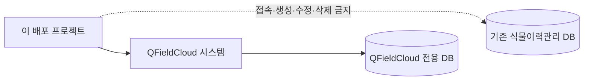

# QFieldCloud AWS Self-Hosting

> [!IMPORTANT]
> 이 저장소는 QFieldCloud를 AWS에 배포하기 위한 **독립적인 비공식 프로젝트**입니다. OPENGIS.ch의 공식 제품, 공식 설치 프로그램 또는 공식 지원 프로젝트가 아니며, OPENGIS.ch의 보증이나 지원을 받지 않습니다.

AWS(Amazon Web Services)를 처음 사용하는 사람도 몇 가지 필수 항목만 입력해 QFieldCloud를 구축할 수 있는 재현 가능한 자동화 도구를 만드는 프로젝트입니다. 수목원 식물이력관리는 활용 사례 중 하나이며, 도구 자체는 다른 기관도 재사용할 수 있도록 설계합니다.

## 현재 단계

현재는 **Phase 1: 문서와 안전한 저장소 골격**입니다. 이 저장소에는 아직 실행 가능한 CloudFormation 템플릿, 설치 스크립트, Docker Compose 또는 Launch Stack 버튼이 없습니다. 문서의 절차는 설계안이며 실제 배포 성공을 의미하지 않습니다.

## 반드시 지키는 경계

- QFieldCloud 공식 소스를 포크하거나 수정하지 않고, 검증한 공식 릴리스와 공식 컨테이너 이미지를 사용합니다.
- 운영 버전은 릴리스 태그, Git 커밋 및 가능하면 플랫폼별 이미지 digest(내용으로 계산한 변경 불가능한 식별값)로 고정합니다.
- 암호화 키와 비밀번호는 GitHub가 아니라 사용자의 AWS 안에서 생성·보관합니다.
- 자체 메일서버를 구축하지 않습니다. 필요할 때만 Amazon SES 또는 기관 SMTP를 선택합니다.
- 설치뿐 아니라 상태확인, 로그, 백업, 복원시험, 명시적 업데이트, 롤백 및 안전한 삭제를 설계합니다.

## 데이터베이스 분리 원칙

QFieldCloud 시스템 DB와 기존 식물이력관리 PostgreSQL/PostGIS DB는 **서로 완전히 별개의 시스템**입니다.

이 배포기는 기존 식물이력 DB의 주소나 인증정보를 요구하지 않으며, 해당 DB에 접속·생성·수정·삭제하지 않습니다. 사용자가 나중에 QGIS 프로젝트에서 별도 데이터 소스를 연결하는 일은 배포와 다른 작업이며 별도의 승인과 보안 검토가 필요합니다.

## 배포 프로필 비교

아래 금액은 설계 비교용 추정치입니다. 환율, 부가가치세, 데이터 전송량, 백업 크기와 AWS 가격 변경에 따라 달라지므로 자원을 만들기 직전에 [AWS Pricing Calculator](https://calculator.aws/)로 다시 확인해야 합니다.

| 항목 | `lab-lightsail` | `standard-aws` |
|---|---|---|
| 목적 | 학습·내부 시험·소규모 검증 | 장기 운영·확장·다른 기관 배포 |
| 컴퓨팅 | Lightsail Linux 한 대 | EC2 한 대 이상 |
| 시스템 DB | 같은 서버의 전용 PostgreSQL/PostGIS | 별도 RDS PostgreSQL/PostGIS |
| 객체 저장소 | 같은 서버의 로컬 S3 호환 저장소 | S3 및 Versioning |
| 장애 영향 | 서버 한 대 장애 시 전체 서비스 중단 | 서비스별 장애 격리 가능 |
| 초기 월 비용 추정 | 약 3만~5만 원 이상 | 약 10만~25만 원 이상 |
| 권장 용도 | 중요하지 않은 시험 데이터 | 업무용 운영 후보 |

> [!WARNING]
> `lab-lightsail`은 **단일 장애점**이 있는 실험용 standalone 구성입니다. 공식 운영 보장 구성으로 표현하지 않으며, 서버 한 대가 고장 나면 앱, worker, DB와 객체 저장소가 함께 중단될 수 있습니다.

`lab-lightsail`의 4GB RAM, 2 vCPU, swap 4GB, worker 1개는 공식 최소사양이 아니라 **초기 시험 가정**입니다. 실제 적정 크기는 시험 프로젝트로 측정해야 합니다. 월 1만 원 목표는 이 가정과 현재 AWS 가격 수준에서 현실적이지 않습니다.

## 삭제 전 주의

인스턴스를 정지하는 것만으로 모든 요금이 사라지는 것은 아닙니다. 스냅샷, 디스크, 객체, RDS, 로드 밸런서, 고정 IP와 로그가 남을 수 있습니다. 삭제 전에는 백업과 복원 가능성을 확인하고, 삭제 후에는 AWS Billing에서 잔존 자원을 확인해야 합니다. 자세한 절차는 [안전한 삭제 실행서](docs/runbooks/uninstall.md)를 참고하세요.

## 문서 지도

| 문서 | 역할 |
|---|---|
| [아키텍처](docs/architecture.md) | 두 프로필의 구성과 데이터 경계 |
| [비용](docs/costs.md) | 추정 비용, 비용 증가 요인과 중단 방법 |
| [보안 모델](docs/security-model.md) | 인증정보, IAM, Docker socket과 네트워크 위험 |
| [버전 정책](docs/version-policy.md) | 공식 릴리스·커밋·이미지 digest 고정 방식 |
| [라이선스와 상표](docs/trademarks-and-licenses.md) | 재배포 고지와 비공식 프로젝트 표시 |
| [문제 해결](docs/troubleshooting.md) | 안전한 진단 순서 |
| [운영 실행서](docs/runbooks/) | 설치부터 삭제까지 단계별 설계 |
| [보안 정책](SECURITY.md) | 취약점 신고와 민감정보 취급 |
| [고지](NOTICE.md) | QFieldCloud와 이 프로젝트의 관계 |

## 공식 자료

- [QFieldCloud 공식 저장소](https://github.com/opengisch/QFieldCloud)
- [QFieldCloud self-hosting 공식 문서](https://docs.qfield.org/reference/qfieldcloud/self_hosted/)
- [QFieldCloud 공식 아키텍처](https://docs.qfield.org/reference/qfieldcloud/architecture/)
- [AWS CloudFormation 공식 문서](https://docs.aws.amazon.com/cloudformation/)
- [AWS Lightsail 가격](https://aws.amazon.com/lightsail/pricing/)

## 다음 단계

Phase 2에서 버전 매니페스트와 읽기 전용 검증 도구를 설계합니다. 비용이 발생하는 실제 AWS 시험은 별도의 설명과 사용자 승인 없이는 수행하지 않습니다.
