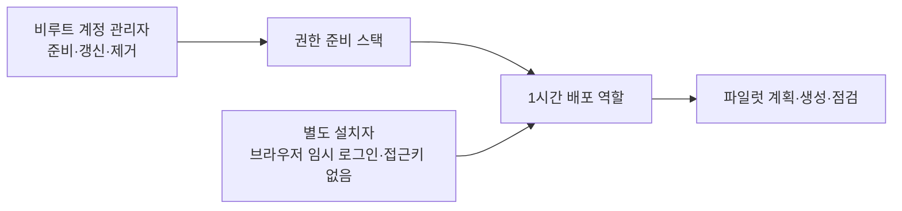

# AWS 배포 권한 준비와 유지관리

이 문서는 외부 사용자가 매번 루트 사용자와 배포 사용자를 번갈아 로그인하지 않도록 만드는 절차입니다. AWS 계정 안에서 권한을 처음 만드는 작업은 비루트 계정 관리자가 해야 합니다. **관리자와 설치자 로그인을 분리한 경우** 준비 뒤의 일반 설치와 점검에는 관리자 로그인이 필요하지 않습니다. 한 사람이 `qfc-admin`을 설치 원본 프로필로 계속 쓰는 간편 경로도 가능하지만, 그 원본 세션의 관리자 권한은 그대로 남으므로 최소 권한 분리가 아닙니다.



권한 준비 스택의 고정 이름은 `qfieldcloud-lab-access`입니다. 이 스택은 다음 두 IAM(접근 권한 관리) 자원만 만듭니다.

- `QFieldCloudLabDeployer` 역할: 설치할 때 발급되는 각 임시 자격증명을 최대 1시간 사용
- `QFieldCloudLabDeployer` 고객 관리형 정책: 역할에 연결하고 permissions boundary(권한 상한선)로도 적용

IAM 사용자, 그룹, 콘솔 비밀번호, Access Key(장기 접근키)는 만들지 않습니다. 파일럿 스택 삭제와 삭제 방지 해제 권한도 포함하지 않습니다.

> [!IMPORTANT]
> 권한 준비 도구와 역할 전환 설치 도구는 로컬 정적 시험 및 AWS CloudFormation 문법 검증을 통과했습니다. 실제 새 계정에서 권한 스택 생성부터 역할 전환까지의 종단 간 시험은 아직 완료하지 않았습니다. 검증 완료 전에는 파일럿 기능으로 취급하세요.

## 1. 준비할 것

1. Windows용 PowerShell 7, Git, 공식 AWS CLI 버전 2
2. 공개 저장소에서 받은 깨끗한 commit. `git status --short`가 아무것도 출력하지 않아야 함
3. 루트가 아닌 계정 관리자용 임시 프로필 하나
4. 관리자와 분리한 설치자 IAM 사용자 또는 IAM Identity Center permission set 하나
5. 자신의 12자리 AWS 계정 ID. 채팅, 문서, GitHub 이슈에 붙여 넣지 않음

관리자 프로필은 다음 중 하나여야 합니다.

- 이미 운영 중인 조직: IAM Identity Center의 관리자 permission set(권한 묶음)
- 단독 계정: 콘솔 전용 비루트 관리자와 `aws login` 임시 브라우저 자격증명

IAM Identity Center permission set을 신뢰 주체로 사용할 때는 그 permission set이 고정 역할 `arn:aws:iam::<12자리 계정 ID>:role/qfieldcloud-lab/QFieldCloudLabDeployer`에 대한 `sts:AssumeRole`을 허용해야 합니다. 일반적인 관리자 permission set에는 포함되지만 제한된 permission set에는 계정 관리자가 이 한 항목을 추가해야 할 수 있습니다. 역할 신뢰 정책과 permission set 중 한쪽이라도 허용하지 않으면 역할 전환은 실패합니다.

루트 사용자, Access Key가 저장된 프로필, 환경변수 자격증명, 임의 AWS endpoint는 도구가 거부합니다.

### 계정에 루트 사용자만 있는 경우

이 도구는 루트 사용자를 대신해 최초 관리자를 만들지 않습니다. 다음 준비만 루트 콘솔에서 한 번 수행하고 바로 로그아웃합니다.

1. 루트 MFA가 없다면 먼저 등록합니다. 루트 Access Key는 만들지 않습니다.
2. **IAM → User groups → Create group**에서 `qfc-account-admins`를 만들고 AWS 관리형 `AdministratorAccess`를 연결합니다.
3. **IAM → Users → Create user**에서 `qfc-account-admin`을 만들고 위 그룹에 넣습니다.
4. 해당 사용자 → **Security credentials → Console access**에서 콘솔 로그인을 활성화하고, 첫 로그인 때 본인만 아는 새 암호로 바꿉니다. Access Key는 만들지 않습니다.
5. 해당 사용자로 다시 로그인해 **Security credentials → Multi-factor authentication (MFA) → Assign MFA device**를 완료합니다.
6. 루트에서 로그아웃하고 이후 준비·갱신·제거에는 이 비루트 관리자를 사용합니다.

그 다음 비루트 관리자가 별도 설치자를 준비합니다.

- 단독 계정: **IAM → Users → Create user**에서 `qfc-installer`를 만들고 콘솔 접근과 MFA만 설정합니다. AWS 관리형 `SignInLocalDevelopmentAccess`만 연결하고 Access Key는 만들지 않습니다.
- 조직 계정: 별도 IAM Identity Center permission set을 설치자에게 할당합니다. 이 permission set에는 최종 고정 역할에 대한 `sts:AssumeRole`만 허용하고 관리자 권한은 주지 않습니다.

설치자 ARN은 IAM 사용자 상세 화면의 **ARN** 또는 Identity Center가 만든 `AWSReservedSSO_...` 역할 화면에서 관리자가 직접 확인합니다. 채팅이나 GitHub에는 붙여 넣지 않습니다. `SignInLocalDevelopmentAccess`는 콘솔 자격증명으로 `aws login` 임시 토큰을 받는 권한일 뿐, Lightsail 생성 권한은 주지 않습니다.

## 2. 관리자 임시 로그인

IAM Identity Center를 이미 사용하는 조직은 다음처럼 로그인합니다.

```powershell
aws configure sso --profile qfc-admin
aws sso login --profile qfc-admin
```

`aws configure sso` 질문에는 다음처럼 답합니다.

- `SSO region`: 계정 관리자가 알려 준 **IAM Identity Center 홈 리전**
- `CLI default client Region`: 파일럿 배포 리전인 `ap-northeast-2`
- `CLI default output format`: `json` 또는 빈칸

두 리전은 역할이 다르며 서로 다른 값일 수 있습니다. `CLI default client Region`을 비우거나 다른 리전으로 두면 이 설치 도구는 안전을 위해 중단합니다.

단독 계정의 콘솔 전용 비루트 관리자는 AWS CLI `2.32.0` 이상에서 다음처럼 로그인합니다.

```powershell
$aws = "$env:LOCALAPPDATA\Programs\Amazon\AWSCLIV2\aws.exe"
& $aws login --profile qfc-admin --region ap-northeast-2
```

브라우저에는 계정 번호나 ARN(AWS 자원 고유 이름)이 나타날 수 있습니다. 화면이나 전체 출력은 공유하지 마세요.

## 3. 로컬 안전 계약 검사

저장소 루트에서 실행합니다. 이 단계는 AWS API를 호출하지 않습니다.

```powershell
pwsh -NoProfile -File .\scripts\lab-lightsail\Test-IamPolicies.ps1
pwsh -NoProfile -File .\scripts\lab-lightsail\Test-AccessBootstrap.ps1
pwsh -NoProfile -File .\scripts\lab-lightsail\Test-Onboarding.ps1
git status --short
```

앞의 세 명령은 모두 통과해야 하며 마지막 명령은 아무것도 출력하지 않아야 합니다.

## 4. 권한 준비 계획만 확인

먼저 `-Execute` 없이 실행합니다. AWS의 현재 관리자 세션, 같은 이름의 기존 IAM 자원, 공개 GitHub commit과 템플릿을 읽기만 하며 자원을 만들지 않습니다.

```powershell
pwsh -NoProfile -File .\scripts\lab-lightsail\Grant-QFieldCloudPilotAccess.ps1 `
  -AdminProfile qfc-admin `
  -ExpectedAccountId '<12자리 계정 ID>'
```

권장 경로는 관리자와 별도인 설치자를 신뢰 주체로 지정하는 것입니다. 관리자가 확인한 정확한 IAM 사용자 ARN 또는 `AWSReservedSSO_...` 역할 ARN을 현재 PowerShell 세션의 변수에만 넣고 다음처럼 실행합니다.

```powershell
$installerPrincipalArn = '<정확한 같은 계정 IAM 사용자 또는 AWSReservedSSO 역할 ARN>'
pwsh -NoProfile -File .\scripts\lab-lightsail\Grant-QFieldCloudPilotAccess.ps1 `
  -AdminProfile qfc-admin `
  -ExpectedAccountId '<12자리 계정 ID>' `
  -TrustedPrincipalArn $installerPrincipalArn
```

개인 실험에서 관리자 자신을 설치자로도 쓸 때만 `-TrustedPrincipalArn`을 생략합니다. 이 기본값은 현재 관리자 주체를 신뢰하며, 이후 `qfc-admin` 로그인을 계속 요구할 수 있습니다. 역할을 맡은 AWS 호출은 제한되지만 원본 관리자 세션 자체는 제한되지 않습니다.

ARN을 채팅이나 GitHub에 붙여 넣지 마세요. 입력값의 wildcard(`*`, `?`), 다른 계정, 경로가 있는 일반 IAM 사용자와 STS 세션 ARN은 거부됩니다. Identity Center는 입력한 현재 역할 ARN에서 정확한 permission set 이름을 확인한 뒤, AWS가 역할을 다시 만들 때 달라지는 16자리 suffix만 신뢰 정책의 `_*`로 허용합니다. IAM 사용자는 **준비 시점에만** 장기 Access Key가 0개이고 MFA 장치가 하나 이상 등록되어 있는지 확인합니다. 이후 매 역할 전환 때 MFA 사용을 자동 강제하거나 새 Access Key 생성을 감시하지는 않습니다.

계획에서 다음을 확인합니다.

- `Action`: `plan-only`
- `Region`: `ap-northeast-2`
- `StackName`: `qfieldcloud-lab-access`
- `ExistingStack`, `ExistingDeploymentRole`, `ExistingDeploymentPolicy`: 모두 `False`
- `CreatesUsersOrKeys`: `False`
- `CleanupPermission`: `not-included`
- `TerminationProtection`: `enabled-at-create`
- `StackUpdatePolicy`: `deny-all-updates`
- `FailureRollback`: `enabled-with-retain-except-on-create`

하나라도 예상과 다르면 실행하지 마세요.

## 5. 권한 준비 실행

계획을 검토한 뒤 같은 명령에 `-Execute`를 추가합니다.

```powershell
pwsh -NoProfile -File .\scripts\lab-lightsail\Grant-QFieldCloudPilotAccess.ps1 `
  -AdminProfile qfc-admin `
  -ExpectedAccountId '<12자리 계정 ID>' `
  -TrustedPrincipalArn $installerPrincipalArn `
  -Execute
```

도구가 요청하면 다음 문구를 정확히 입력합니다.

```text
CREATE qfieldcloud-lab-access
```

도구는 생성 뒤 역할의 신뢰 범위, 1시간 제한, 연결 정책, permissions boundary, 정책 checksum과 삭제 권한 제외 상태를 다시 읽어 확인합니다. `retain-except-on-create` 때문에 최초 생성 rollback에서는 그 시도에서 새로 만든 IAM 자원이 삭제될 수 있지만 실패한 스택 기록은 남을 수 있습니다. 성공한 권한 스택이나 성공한 IAM 자원을 도구가 자동 삭제하지는 않습니다.

## 6. 이후 파일럿 계획과 설치

관리자 브라우저 세션에서 로그아웃한 뒤 별도 설치자로 로그인합니다. 단독 계정 IAM 사용자는 다음처럼 설치자 프로필을 만듭니다.

```powershell
$aws = "$env:LOCALAPPDATA\Programs\Amazon\AWSCLIV2\aws.exe"
& $aws login --profile qfc-installer --region ap-northeast-2
```

IAM Identity Center 설치자는 `aws configure sso --profile qfc-installer`와 `aws sso login --profile qfc-installer`를 사용합니다. 위와 같이 `SSO region`에는 홈 리전, `CLI default client Region`에는 반드시 `ap-northeast-2`를 입력합니다. 다음 명령은 이 브라우저 로그인을 갱신할 수 있고, 로컬 AWS config에 비밀값이 없는 `qfc-lab-role` 역할 프로필을 만들거나 이전 중단 상태를 복구합니다. **계획 모드도 이 두 로컬 상태는 바꿀 수 있지만 AWS 과금 자원은 만들지 않습니다.**

```powershell
pwsh -NoProfile -File .\scripts\lab-lightsail\Install-QFieldCloudPilot.ps1 `
  -SourceProfile qfc-installer `
  -RoleProfile qfc-lab-role `
  -ExpectedAccountId '<12자리 계정 ID>'
```

계획의 `PrincipalType`은 `temporary-assumed-deployment-role`이어야 합니다. 비용, 실패 시 잔존 과금, 자동 삭제 없음과 제거 절차를 검토한 뒤에만 `-Execute`를 추가합니다.

```powershell
pwsh -NoProfile -File .\scripts\lab-lightsail\Install-QFieldCloudPilot.ps1 `
  -SourceProfile qfc-installer `
  -RoleProfile qfc-lab-role `
  -ExpectedAccountId '<12자리 계정 ID>' `
  -Execute
```

첫 계획 검사 뒤 도구가 Git commit과 비용·자원·충돌 상태를 포함한 계획의 SHA-256을 메모리에 보관합니다. 실제 생성 직전에 긴 확인 문구를 한 번 더 요청하고, commit이나 계획이 조금이라도 달라지면 생성하지 않고 새 계획 검토를 요구합니다. 생성이 실패해도 파일럿 자원은 자동 삭제되지 않으며 별도 삭제 승인이 필요합니다.

## 7. 세션 종료

- 로컬 역할 프로필에는 Access Key나 토큰을 저장하지 않습니다. 원본 브라우저 세션을 통해 **각각 최대 1시간인** 역할 자격증명을 필요할 때 새로 받을 수 있습니다. 프로필 자체가 1시간 뒤 삭제되는 것은 아닙니다.
- 작업을 끝내면 IAM 사용자는 `& $aws logout --profile qfc-installer`, Identity Center는 `aws sso logout`으로 원본 로그인 캐시도 종료합니다.
- 즉시 기존 역할 세션을 모두 막아야 하면 비루트 관리자가 IAM → **Roles → QFieldCloudLabDeployer → Revoke sessions → Revoke active sessions**를 사용합니다. 이는 이후 새로 발급한 세션까지 영구 차단하는 기능은 아닙니다.

## 8. create-only 권한 스택의 갱신과 완전 제거

현재 `qfieldcloud-lab-access`는 **create-only(처음 생성 뒤 일반 설치 도구로 갱신하지 않는 구조)**입니다. deny-all stack policy가 모든 업데이트를 막고, 같은 이름의 기존 스택·역할·정책이 있으면 준비 도구가 재실행을 거부합니다. 정책 revision이나 신뢰 주체를 바꿀 때 기존 역할을 콘솔에서 임의 편집하지 마세요.

### 검토된 갱신 절차

1. 비루트 관리자로 로그인하고 현재 역할의 **Trust relationships**, 연결 정책, permissions boundary와 정책 기본 버전을 기록합니다. Secret은 기록하지 않습니다.
2. 새 기능 브랜치와 Pull Request에서 템플릿·정책 변경, 비용 영향, 되돌리기 방법과 정적 검사 결과를 검토합니다.
3. CloudFormation → 서울 리전 → `qfieldcloud-lab-access` → **Update**를 선택하고 검토한 새 템플릿을 올립니다.
4. **Stack policy during update**에는 필요한 두 논리 자원만 허용하는 임시 override를 사용합니다. 관리자가 영구 deny-all 정책 자체를 완화하지 말며, 전체 `Update:*` 허용을 영구 정책으로 저장하지 않습니다.

   ```json
   {
     "Statement": [
       {
         "Effect": "Allow",
         "Action": "Update:*",
         "Principal": "*",
         "Resource": [
           "LogicalResourceId/LabDeploymentRole",
           "LogicalResourceId/LabDeploymentPolicy"
         ]
       }
     ]
   }
   ```

5. change set에서 `LabDeploymentRole`과 `LabDeploymentPolicy` 이외의 자원이 없고 교체가 아니라 의도한 수정인지 확인한 뒤에만 실행합니다.
6. 완료 뒤 이 문서 3절의 세 정적 검사와 역할 전환 계획을 다시 실행합니다. 세 정적 검사는 저장소 파일만 검사하므로 배포된 IAM 상태를 증명하지 않습니다. IAM → **Roles → QFieldCloudLabDeployer**에서 trust 주체·최대 세션 1시간·permissions boundary·연결 정책을, IAM → **Policies → QFieldCloudLabDeployer → Policy versions**에서 새 버전이 기본인지 별도로 확인합니다. 저장소 정책과 실제 기본 버전 JSON도 비교합니다. 하나라도 다르거나 역할 전환이 실패하면 CloudFormation 이벤트를 보존하고 별도 승인 없이 수동 덮어쓰기하지 않습니다.

현재 저장소에는 이 갱신을 자동 검증하는 실행 스크립트가 없습니다. 따라서 위 절차는 고급 관리자 작업이며, 검토된 override와 되돌리기 계획이 없다면 새 설치를 중단해야 합니다.

### 완전 제거 절차

1. 파일럿과 보존 데이터 상태를 먼저 확인합니다. 접근 스택 제거는 파일럿 서버를 삭제하지 않습니다.
2. 모든 사용자가 설치자 원본 프로필에서 로그아웃하게 하고, IAM → **Roles → QFieldCloudLabDeployer → Revoke sessions**에서 기존 역할 세션을 폐기합니다.
3. CloudFormation → 서울 리전 → `qfieldcloud-lab-access` → **Stack actions → Edit termination protection → Disable**을 선택합니다.
4. 스택을 삭제합니다. 두 IAM 자원은 `Retain`이므로 스택만 `DELETE_COMPLETE`가 되고 역할·정책은 남는 것이 정상입니다.
5. IAM → **Roles → QFieldCloudLabDeployer**에서 역할을 먼저 삭제합니다. 그 다음 IAM → **Policies → QFieldCloudLabDeployer**에서 연결 대상이 0인지 확인하고 정책을 삭제합니다.
6. 로컬 `%USERPROFILE%\.aws\config`에서 `[profile qfc-lab-role]` 섹션만 제거합니다. 다른 프로필이나 credentials 파일은 삭제하지 않습니다.
7. 역할, 정책, access 스택이 모두 없고 파일럿 비용 자원의 상태는 변하지 않았는지 다시 확인합니다.
8. `qfc-installer`가 이 파일럿만 위한 전용 IAM 사용자라면 MFA와 다른 사용처가 없는지 확인한 뒤 사용자를 삭제합니다. Identity Center 설치자라면 해당 AWS 계정의 permission set 할당을 해제합니다. 다른 업무와 공유하는 주체라면 삭제하지 말고 이 파일럿용 `sts:AssumeRole` 권한만 제거합니다.

## 9. 파일럿 제거 주의

- `qfieldcloud-lab-access` 스택은 생성할 때 삭제 방지를 켭니다.
- 역할과 정책에는 `DeletionPolicy: Retain`이 있어, 관리자가 삭제 방지를 해제하고 스택을 삭제해도 두 IAM 자원은 남습니다. 이는 우발적으로 배포 접근을 잃지 않게 하는 선택입니다.
- 남은 역할과 정책을 정말 제거하려면 현재 설치와 백업 상태를 확인한 뒤 별도 관리자 절차와 별도 승인이 필요합니다.
- 파일럿 삭제 권한은 이 역할에 영구 추가하지 않습니다. 이 역할의 permissions boundary도 삭제 권한을 막으므로 cleanup 정책을 역할에 추가해 우회할 수 없습니다. 승인된 삭제 시간에는 비루트 계정 관리자 또는 별도 검토한 cleanup 세션을 사용하고, 임시 정책을 연결했다면 삭제 직후 제거합니다.

파일럿의 비용·설치·실패·백업·복원·삭제 절차는 [lab-lightsail 안내서](lab-lightsail.md)를 이어서 확인하세요.
