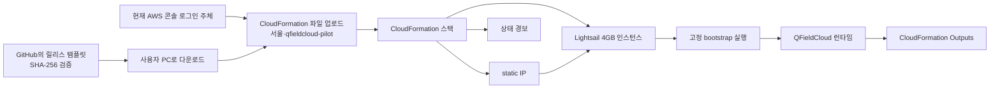
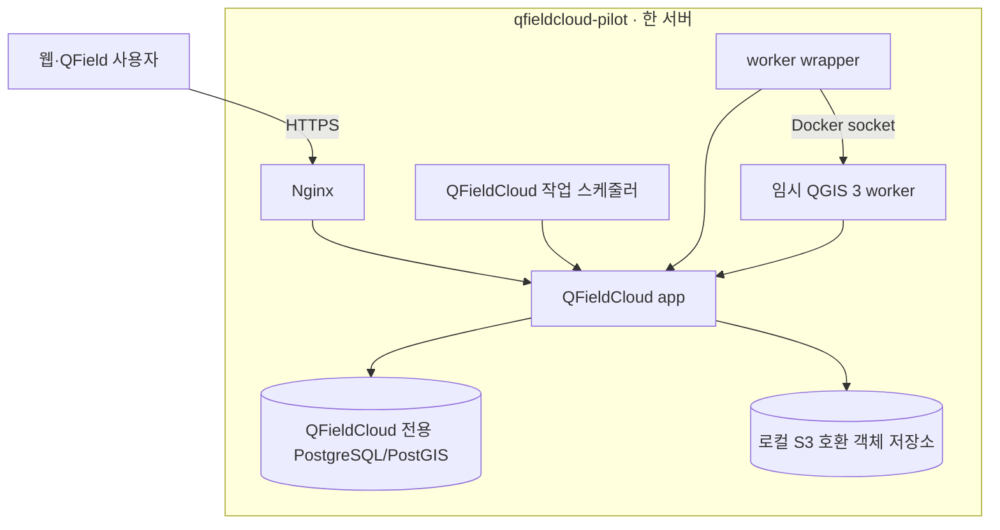
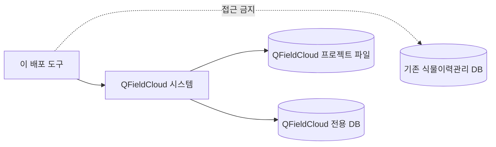

# 아키텍처

## 목적과 상태

`lab-lightsail`은 개인 담당자가 완성된 YAML 파일을 CloudFormation에 업로드하여 단일 Lightsail 서버에 QFieldCloud를 설치하는 저비용 파일럿입니다.

현재 다운로드용 `v0.1.2` 완성 템플릿은 저장소에 포함되어 있습니다. 아래 구조는 현재 기본 흐름이며 실제 AWS 성공 종단 간 검증 완료를 의미하지는 않습니다.

## 브라우저 수동 업로드 흐름

사용자는 Git, PowerShell, AWS CLI, 저장소 clone, 계정 ID·ARN 입력 또는 역할 전환을 하지 않습니다. 현재 주체에 CloudFormation과 Lightsail 권한이 부족하면 AWS가 오류를 표시합니다.

템플릿은 별도 IAM 사용자·역할·정책을 만들지 않습니다. 루트 사용자도 차단하지 않지만 MFA를 사용하고 루트 Access Key를 만들지 않아야 합니다.

## 단일 서버 내부

서버는 Linux 4GB RAM, 2 vCPU, 80GB SSD와 월 4TB 전송량이 포함된 Lightsail 상품입니다. 4GB와 worker 한 개는 공식 최소사양이 아니라 작은 파일럿을 위한 검증 가정입니다.

PostgreSQL/PostGIS와 객체 저장소 관리 포트는 외부에 공개하지 않습니다. HTTP 80과 HTTPS 443만 공개하며 SSH 22는 Lightsail 브라우저 SSH 경로로 제한합니다.

## 설치 완료 경계

CloudFormation의 WaitCondition(완료 대기 조건)은 다음 작업이 끝날 때까지 스택 완료를 막습니다.

1. Docker와 고정 실행 파일 설치
2. QFieldCloud 전용 DB와 객체 저장소 준비
3. migration과 정적 파일 준비
4. 관리자 계정 생성
5. Nginx와 HTTPS 구성
6. 상태 endpoint 확인
7. QGIS 3 worker 최소 기능 시험
8. 최종 health check

`CREATE_COMPLETE` 뒤 Outputs는 HTTPS URL, 인스턴스 이름, 설치 상태, 관리자 자격증명 확인 명령과 삭제 안내를 제공합니다. 비밀번호나 Secret 값은 Outputs에 포함하지 않습니다.

## 데이터 경계

기존 식물이력관리 DB는 주소, 인증정보와 네트워크 모두 이 설치의 입력이 아닙니다. 사용자가 나중에 QGIS 프로젝트에서 업무 DB를 연결하는 일은 별도의 보안·권한 작업입니다.

## 데이터 보호 경계

> [!WARNING]
> 이 파일럿은 백업, 복원 작업과 자동 snapshot을 제공하지 않습니다. Lightsail 인스턴스·디스크 또는 CloudFormation 스택을 삭제하면 QFieldCloud 데이터를 복구할 수 없습니다.

한 서버 장애 시 앱, DB와 객체 저장소가 함께 중단됩니다. 복구 목표가 필요한 운영 환경은 별도 DB, 별도 객체 저장소와 검증된 데이터 보호 체계를 갖춘 `standard-aws` 구조가 필요합니다.

## 실패와 비용 경계

CloudFormation 생성 또는 삭제가 실패하면 다음 자원이 남을 수 있습니다.

- Lightsail 인스턴스
- static IP
- 디스크
- 상태 경보
- 사용자가 별도로 만든 수동 snapshot

연결된 static IP는 추가 비용이 없지만 분리된 static IP는 시간당 US$0.005가 과금될 수 있습니다. 스택 작업이 끝난 뒤 CloudFormation, Lightsail와 Billing을 함께 확인해야 합니다.

## `standard-aws`와의 구분

`standard-aws`는 EC2, RDS PostgreSQL/PostGIS, S3와 관리형 Secret을 분리하는 미래 운영 프로필입니다. 현재 실행 가능한 원클릭 템플릿이 없으며 `lab-lightsail`과 DB나 저장소를 공유하지 않습니다.

세부 통제는 [보안 모델](security-model.md), 사용자 절차는 [파일럿 안내서](lab-lightsail.md)를 참고하세요.
