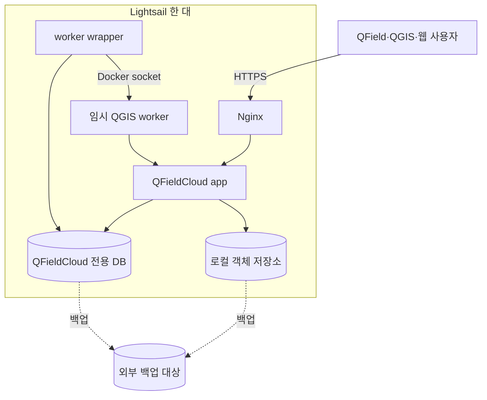
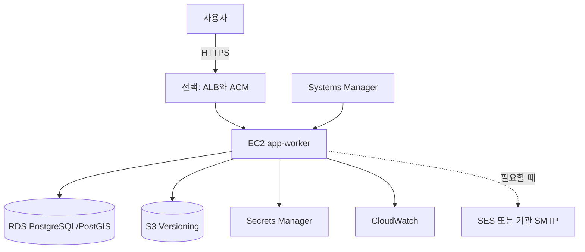

# 아키텍처 설계

## 문서 상태

- **확인된 사실:** 공식 QFieldCloud는 app, Nginx, cache, worker wrapper, 작업마다 생성되는 임시 QGIS worker, PostgreSQL/PostGIS 및 S3 호환 객체 저장소로 구성됩니다. 공식 설명은 [QFieldCloud 아키텍처](https://docs.qfield.org/reference/qfieldcloud/architecture/)에 있습니다.
- **프로젝트 추론:** 구성요소를 한 서버에 모으면 설치는 단순하지만 장애 범위가 커집니다.
- **프로젝트 권고:** 학습용과 운영 후보를 분리하고, 두 환경 사이에 데이터베이스를 공유하지 않습니다.

## 공통 경계

QFieldCloud 시스템 DB는 QFieldCloud 사용자, 프로젝트 메타데이터와 작업 상태를 저장합니다. 기존 식물이력관리 PostgreSQL/PostGIS는 별도 업무 시스템입니다. 배포기는 기존 DB의 주소나 인증정보를 입력받지 않고 네트워크 연결도 만들지 않습니다.

worker wrapper는 대기 작업을 가져와 작업별 임시 QGIS worker를 만들고, 결과와 로그를 회수한 뒤 worker를 삭제합니다. 공식 Compose는 이 동작을 위해 호스트 Docker socket을 사용하므로 호스트 관리자 권한에 가까운 위험으로 다룹니다.

## `lab-lightsail`

4GB RAM, 2 vCPU, swap 4GB, worker 1개는 **초기 시험 가정**이며 공식 최소사양이 아닙니다. 단일 서버 장애 시 전체 서비스가 중단되므로 중요 운영을 보장하지 않습니다.

## `standard-aws`

EC2는 앱과 worker를 실행하고, RDS와 S3는 영구 데이터를 분리합니다. IAM 역할은 최소 권한으로 S3와 Secret 접근을 허용합니다. ALB, Route 53, ACM, WAF 및 SES는 필요와 비용을 확인한 뒤 선택합니다. NAT Gateway는 소규모 환경에서 고정비가 크므로 초기 기본 구성으로 확정하지 않습니다.

## 장애와 복구 경계

| 장애 | lab 영향 | standard 영향 |
|---|---|---|
| 컴퓨팅 호스트 | 전체 중단 | 앱·worker 중단, DB·객체는 분리 보존 |
| DB | 전체 기능 중단 | RDS 복구 정책 적용 |
| 객체 저장소 | 프로젝트 파일 기능 중단 | S3 버전과 백업 정책 적용 |
| Docker socket 악용 | 단일 호스트 장악 가능 | 해당 worker 호스트 장악 가능 |

세부 보안 통제는 [보안 모델](security-model.md), 운영 절차는 [실행서](runbooks/)에서 다룹니다.
