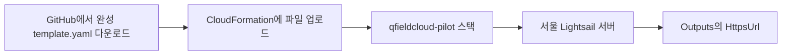
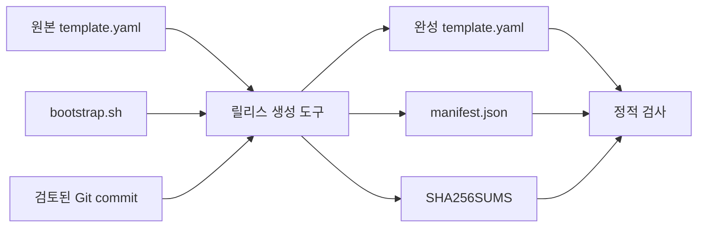
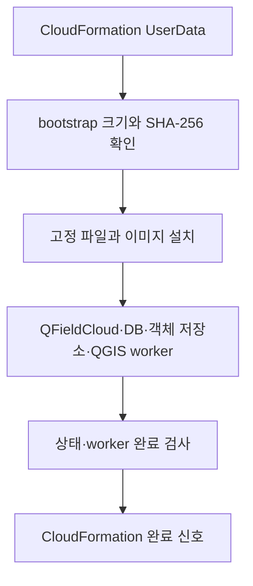

# lab-lightsail 구성 흐름

> `v0.1.0` 완성 템플릿은 다운로드할 수 있지만 실제 AWS 수동 업로드 종단 간 시험은 아직 수행하지 않았습니다.

## 사용자가 보는 흐름

## 릴리스 제작 흐름

원본 템플릿의 자리표시자는 릴리스 생성 도구가 전체 Git commit, bootstrap SHA-256과 릴리스 버전으로 교체합니다. 세 결과 파일을 `releases/lab-lightsail/<버전>/`에 커밋하며 공개한 같은 버전 파일은 덮어쓰지 않습니다.

## 서버 설치 흐름

bootstrap은 검증에 실패하면 실행하지 않습니다. 설치 완료 신호도 전체 서비스와 QGIS worker 검사가 통과한 뒤에만 보냅니다.

공개 S3와 Quick Create는 여러 사용자에게 한 번 클릭 링크가 필요한 관리자를 위한 선택 기능입니다. 일반 사용자의 다운로드·수동 업로드 흐름에는 필요하지 않습니다.
