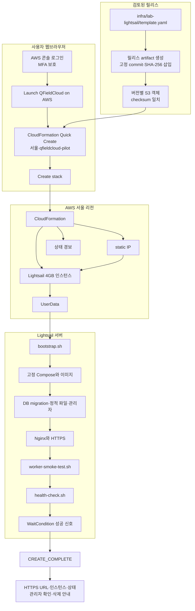
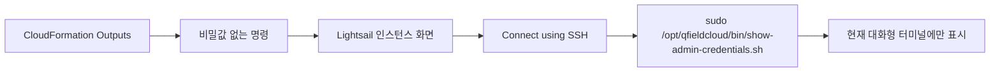
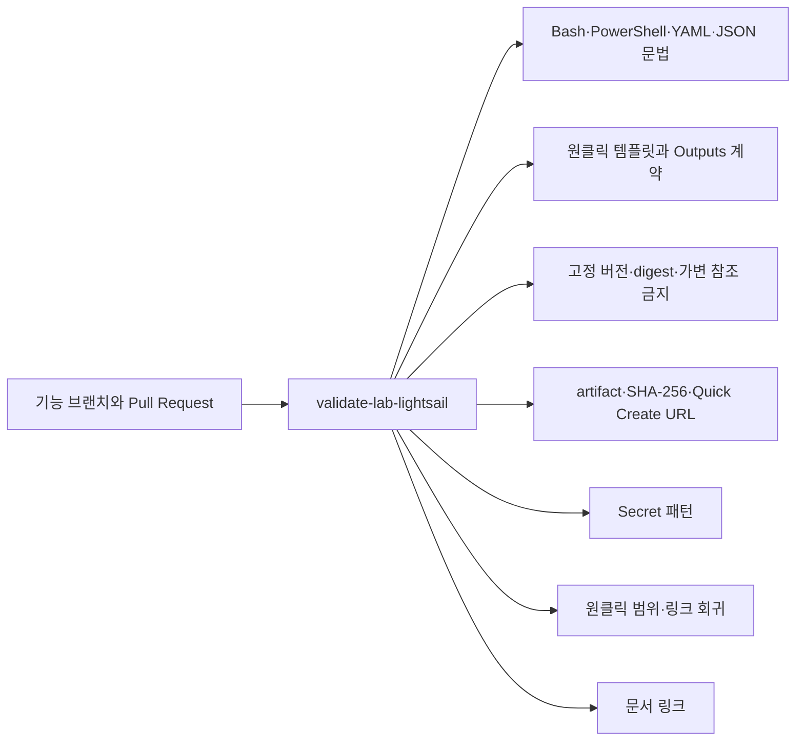

# `lab-lightsail` 원클릭 구조

이 문서는 초보 사용자가 브라우저에서 시작한 뒤 어떤 파일과 AWS 자원이 자동으로 이어지는지 보여 줍니다.

> [!IMPORTANT]
> 릴리스별 S3 템플릿과 실제 Quick Create URL은 아직 게시되지 않았고, 단순화한 흐름은 실제 AWS에서 종단 간 검증하지 않았습니다.

## 전체 흐름

기본 사용자 경로에는 로컬 설치 스크립트, AWS CLI, 계정 ID·ARN 입력 또는 역할 전환이 없습니다. 현재 AWS 로그인 주체가 CloudFormation과 Lightsail 자원을 만들 권한을 이미 가지고 있어야 합니다.

## 릴리스 artifact 경계

저장소의 원본 CloudFormation 템플릿은 곧바로 배포하는 파일이 아닙니다. 게시 단계는 다음을 수행해야 합니다.

1. 검토된 Git commit에서 템플릿 artifact 생성
2. bootstrap의 고정 commit과 SHA-256 삽입
3. artifact SHA-256 생성
4. 변경되지 않는 릴리스 버전 S3 경로에 게시
5. 게시된 객체를 다시 내려받아 checksum 비교
6. 해당 S3 URL로 Quick Create URL 생성
7. 서울 리전과 `qfieldcloud-pilot` 기본값 검증

`main`, `master`, `latest` 경로나 만료되는 서명 URL은 릴리스 입력으로 사용할 수 없습니다. 현재 S3 게시와 URL 생성은 아직 수행하지 않았습니다.

## 서버 파일의 역할

| 파일 | 역할 |
|---|---|
| `infra/lab-lightsail/template.yaml` | Lightsail 인스턴스·static IP·방화벽·상태 경보·WaitCondition·Outputs 정의 |
| `config/qfieldcloud-v26.25.env` | QFieldCloud 릴리스, commit, 이미지 digest와 외부 의존성 고정 |
| `scripts/lab-lightsail/bootstrap.sh` | Docker 설치, QFieldCloud 준비, 관리자 생성, worker·상태검사 실행 |
| `runtime/lab-lightsail/compose.yaml` | app, DB, 객체 저장소, Nginx, worker와 작업 스케줄러 연결 |
| `scripts/lab-lightsail/worker-smoke-test.sh` | 작은 시험 프로젝트로 QGIS 3 작업과 임시 컨테이너 정리 확인 |
| `scripts/lab-lightsail/health-check.sh` | 설치 출처, 이미지, 서비스, 인증서, 보호 파일과 worker 상태 확인 |
| `scripts/lab-lightsail/show-admin-credentials.sh` | 대화형 브라우저 SSH에서만 초기 관리자 정보 표시 |
| `scripts/lab-lightsail/certificate-renew.sh` | 공인 IPv4 인증서 모드의 발급·갱신·검증·안전한 전환 |

데이터를 보존하거나 과거 시점으로 되돌리는 자동 작업과 자동 snapshot은 이 파일럿 흐름에 포함되지 않습니다.

## 관리자 정보 전달

CloudFormation Outputs, UserData와 일반 로그에는 관리자 비밀번호를 넣지 않습니다.

## 완료와 실패

`CREATE_COMPLETE`는 WaitCondition이 다음을 확인했다는 뜻입니다.

- DB migration과 정적 파일 준비
- 필수 컨테이너 상태
- HTTPS와 DB·storage 상태
- QGIS 3 worker 최소 기능 시험
- 최종 health check

그러나 실제 원클릭 AWS 경로는 아직 검증 전입니다. 실패 시 CloudFormation Events에서 첫 오류를 확인하고 스택 삭제 뒤 Lightsail 인스턴스, static IP, 디스크, 경보와 Billing을 확인해야 합니다.

## 정적 검증 구조

정적 검사는 AWS 권한, Lightsail 가용 용량, 실제 인증서 발급, 설치 시간과 삭제 성공을 증명하지 않습니다. 실제 시험은 예상 비용과 삭제 방법을 설명하고 승인받은 뒤에만 수행합니다.
