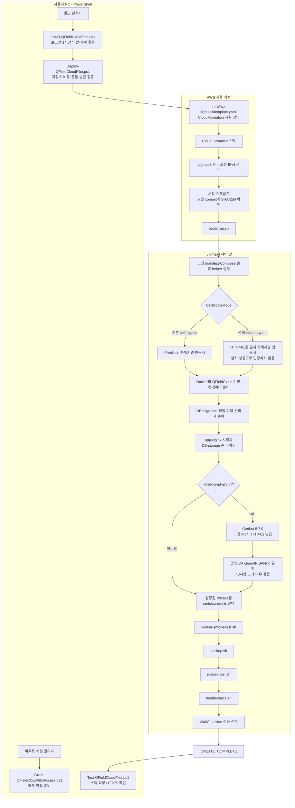
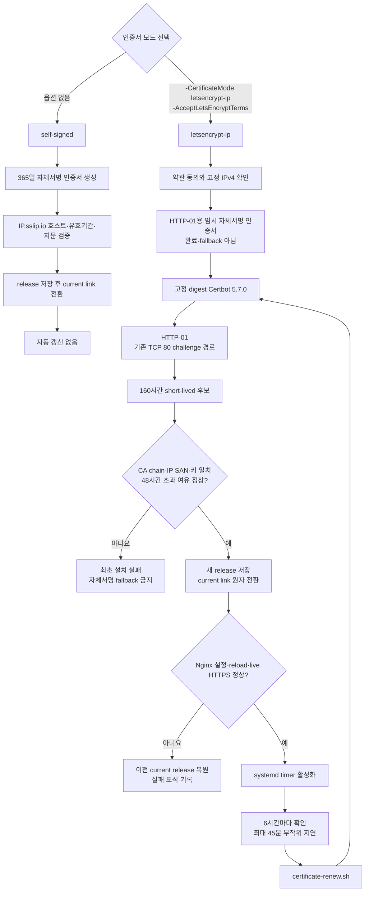
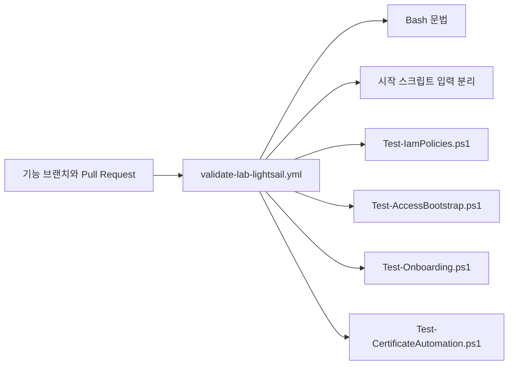

# `lab-lightsail` 스크립트 구조

이 문서는 AWS와 Git을 처음 접하는 사용자가 “어느 파일을 내 PC에서 실행하고, 그 다음 서버 안에서 무엇이 자동으로 실행되는가”를 이해하기 위한 그림입니다. 정확한 설치 명령과 비용·위험은 [파일럿 안내서](../lab-lightsail.md)를 우선합니다.

> [!IMPORTANT]
> 기본 `self-signed` 경로는 2026-08-23 서울 리전의 새 빈 서버에서 실제 검증했습니다. 선택 `letsencrypt-ip` 경로는 코드와 AWS를 호출하지 않는 정적 계약 검사를 추가했지만 **현재 AWS 스택에는 적용하지 않았고 실제 최초 발급·자동 갱신 종단 간 검증 전**입니다.

## 전체 배포 흐름

사용자가 일반 설치 때 직접 시작하는 파일은 `Install-QFieldCloudPilot.ps1`입니다. `bootstrap.sh`와 서버 helper를 PC 터미널에서 한 줄씩 수동 실행하는 구조가 아닙니다. 관리자 권한 준비는 설치와 분리된 `Grant-QFieldCloudPilotAccess.ps1` 흐름이며, 평상시 설치 역할에는 삭제 권한을 넣지 않습니다.

## 인증서 분기와 자동 갱신

`letsencrypt-ip` 갱신 중 CA·인터넷·rate limit 오류가 생기면 아직 유효한 이전 인증서는 그대로 둡니다. 후보 검증 뒤 `current` link를 바꿨더라도 Nginx reload나 실제 HTTPS 확인이 실패하면 이전 link로 되돌립니다. 실패를 숨기기 위해 자체서명 인증서로 교체하지 않습니다.

ACME 계정·발급 이력·로그는 `/opt/qfieldcloud/state/certbot*` 아래 root 전용 상태이고 일반 애플리케이션 백업에서 제외합니다. Lightsail 전체 snapshot에는 들어갈 수 있으므로 snapshot 접근도 Secret처럼 제한합니다.

## 파일별 역할

| 위치 | 파일 | 초보자가 이해할 역할 |
|---|---|---|
| 사용자 PC | `scripts/lab-lightsail/Grant-QFieldCloudPilotAccess.ps1` | 비루트 관리자가 고정 배포 역할과 최소 권한을 준비 |
| 사용자 PC | `scripts/lab-lightsail/Install-QFieldCloudPilot.ps1` | 설치자 로그인, 1시간 역할 프로필, 계획과 실제 배포를 한 흐름으로 연결 |
| 사용자 PC | `scripts/lab-lightsail/Deploy-QFieldCloudPilot.ps1` | Git commit·공개 파일·AWS 대상·비용·기존 자원·승인 hash를 검증하고 CloudFormation 생성 |
| 사용자 PC | `scripts/lab-lightsail/Test-QFieldCloudPilot.ps1` | 완료된 스택, 선택 인증서 모드, 외부 HTTPS·DB·storage를 확인 |
| AWS 정의 | `infra/lab-lightsail/template.yaml` | Lightsail 서버·고정 IP·경보·WaitCondition과 인증서 모드 입력 정의 |
| 서버 설치 | `scripts/lab-lightsail/bootstrap.sh` | 고정 파일 설치, Docker·QFieldCloud·인증서·worker·백업·복원·최종 상태를 순서대로 실행 |
| 서버 설정 | `config/qfieldcloud-v26.25.env` | QFieldCloud, Certbot, 외부 이미지와 자료의 버전·digest·endpoint 고정 |
| 서버 설정 | `runtime/lab-lightsail/compose.yaml` | 앱·DB·Nginx·worker와 유지관리 전용 Certbot 컨테이너 연결 |
| 서버 운영 | `scripts/lab-lightsail/certificate-renew.sh` | 공인 IPv4 인증서 발급·갱신, 후보 검증, 원자 전환과 롤백 |
| 서버 운영 | `scripts/lab-lightsail/health-check.sh` | 설치 출처, 서비스, 인증서 모드·갱신, worker·백업·복원 전체 상태 확인 |
| 서버 운영 | `scripts/lab-lightsail/worker-smoke-test.sh` | 작은 시험 프로젝트로 실제 QGIS 3 작업과 임시 자원 정리 확인 |
| 서버 운영 | `scripts/lab-lightsail/backup.sh` | QFieldCloud DB·객체·media와 분리된 Secret 사본의 로컬 백업 |
| 서버 운영 | `scripts/lab-lightsail/restore-test.sh` | 최신 백업을 격리 임시 DB·storage에 복원해 schema·storage 무결성 확인 |
| 서버 운영 | `scripts/lab-lightsail/show-admin-credentials.sh` | 대화형 root 터미널에서만 초기 관리자 정보와 인증서 확인 정보를 표시 |

## 코드 변경을 막는 검사

정적 검사는 위험한 옵션 누락, 무고정 이미지, 자체서명 fallback, 안전하지 않은 인증서 전환 같은 회귀를 막습니다. 그러나 실제 Let’s Encrypt CA 응답, HTTP-01의 인터넷 도달, 시간 경과 갱신과 재부팅 복구는 대신 검증하지 못합니다. 따라서 `letsencrypt-ip`은 승인된 새 빈 서버에서 최초 발급·강제 또는 시간 경과 갱신·실패 롤백까지 확인하기 전에는 “종단 간 검증 완료”가 아닙니다.
