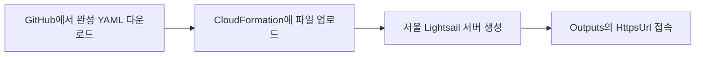

# lab-lightsail 배포 방식

`lab-lightsail`은 학습·검증·소규모 파일럿을 위해 QFieldCloud 구성요소를 AWS Lightsail 서버 한 대에 설치하는 저비용 방식입니다. 운영 안정성보다 설치 단순성과 낮은 비용을 우선합니다.

## 가장 간단한 사용 흐름

상세 클릭 순서는 [설치 실행서](runbooks/install.md)에 있습니다. 기본 흐름에는 공개 S3 버킷이나 Quick Create 링크가 필요하지 않습니다.

## 한 서버 안에 설치되는 것

- QFieldCloud 웹·API 구성요소와 Nginx HTTPS 프록시
- QGIS worker 3개
- QFieldCloud 전용 PostgreSQL/PostGIS
- 로컬 S3 호환 객체 저장소
- 상태 확인과 인증서 갱신 도구

기존 식물이력관리용 PostGIS는 별도 시스템이며 이 템플릿이 주소나 비밀번호를 받거나 연결하지 않습니다.

## 배포 파일과 원본 틀

- 사용자가 올리는 완성본: [`releases/lab-lightsail/v0.1.0/template.yaml`](../releases/lab-lightsail/v0.1.0/template.yaml)
- 완성본 정보와 해시: [`manifest.json`](../releases/lab-lightsail/v0.1.0/manifest.json), [`SHA256SUMS`](../releases/lab-lightsail/v0.1.0/SHA256SUMS)
- 개발자가 관리하는 원본 틀: [`infra/lab-lightsail/template.yaml`](../infra/lab-lightsail/template.yaml)

원본 틀의 자리표시자는 릴리스 생성 도구가 검토된 Git commit과 `bootstrap.sh` SHA-256으로 교체합니다. 따라서 사용자는 원본 틀이 아니라 완성본만 업로드해야 합니다.

## 생성되는 AWS 자원

- Ubuntu 24.04 Lightsail 인스턴스 1개
- 고정 IP 1개, 필요한 네트워크 규칙, 상태 알람 1개
- 설치 완료를 기다리는 CloudFormation 자원

별도 IAM 사용자·역할·정책, 자동 snapshot과 백업은 만들지 않습니다. CloudFormation 콘솔은 업로드 파일을 계정 내부 S3 공간에 보관할 수 있지만 공개 S3 버킷 설정은 필요하지 않습니다.

## 비용과 위험

- 기본 `medium_3_0` Linux 번들은 서울 리전 기준 월 최대 US$24로 설계했습니다.
- 스택 생성 버튼을 누르는 순간부터 비용 자원이 생길 수 있습니다.
- 단일 서버가 멈추면 전체 서비스가 중단됩니다.
- 자동 백업·복원·snapshot이 없으므로 서버나 스택 삭제 시 데이터를 복구할 수 없습니다.
- 기본 자체서명 인증서는 브라우저 경고를 표시합니다.

정확한 과금은 AWS 가격과 계정 상태에 따라 달라질 수 있으므로 [비용 문서](costs.md)도 확인합니다.

## 완료, 삭제, 검증 상태

서버 내부 서비스와 worker 검사가 통과하고 CloudFormation이 `CREATE_COMPLETE`가 되어야 완료입니다. 최대 대기 시간은 150분입니다. 삭제 방법은 [삭제 실행서](runbooks/uninstall.md)에 있습니다.

- 정적 검사 완료: CloudFormation, PowerShell, Bash, 고정 이미지 digest, 릴리스 해시와 문서 링크
- 아직 미검증: 수동 업로드로 실제 새 AWS 스택 생성·서비스 확인·삭제 전체 과정
- 생성 시 달라질 수 있음: `medium_3_0`과 `ap-northeast-2a`의 계정별 가용성

관리자가 여러 사용자에게 한 번 클릭 링크를 제공해야 할 때만 [선택적 S3 게시 절차](release-publishing.md)를 사용할 수 있습니다. 일반 사용자의 기본 설치에는 필요하지 않습니다.
