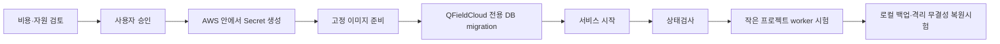

# 설치 실행서

## 현재 상태

`lab-lightsail` 템플릿과 설치 스크립트는 구현되었고, 서울 리전의 새 빈 서버에서 최신 commit의 자동 설치·완료 보고·상태·worker·로컬 백업·격리 복원시험까지 확인했습니다. 새 계정에서 권한 준비부터 역할 전환까지의 종단 간 시험은 아직 완료하지 않았습니다. 신규 계정은 [배포 권한 준비와 유지관리](../access-bootstrap.md)를 먼저 읽고, 설치 명령은 [현재 파일럿 안내서](../lab-lightsail.md)를 사용합니다. 아래 항목은 두 배포 프로필이 계속 지켜야 할 공통 안전 순서이며, `standard-aws` 실행 도구는 아직 없습니다.

## 사전 확인

1. `lab-lightsail` 또는 `standard-aws` 선택
2. 서울 리전과 실제 서비스 가격 확인
3. 도메인과 공인 HTTPS 방식 결정
4. 백업 위치와 보존기간 결정
5. QFieldCloud 검증 릴리스·commit·이미지 digest 확인
6. 기존 식물이력관리 DB 정보가 입력항목에 없는지 확인
7. 생성될 자원, IAM 권한과 삭제 방법 검토

## 제안 흐름

Secret은 Quick Create URL, GitHub 또는 문서 예제에 넣지 않습니다. 설치 실패 시 무조건 재실행하기 전에 어느 단계까지 완료됐는지 확인하며, 반복 실행으로 자원이 중복되지 않도록 설계합니다.

## 완료기준

- HTTPS 접속과 `/api/v1/status/`의 DB·storage 정상
- 관리자 생성 과정에서 Secret이 로그에 노출되지 않음
- 작은 시험 프로젝트의 QGIS 작업 완료
- 최신 로컬 백업과 그 백업의 격리 schema·storage 무결성 시험 완료
- 전체 상태, 백업 한계와 삭제 대상이 문서화됨

상태 endpoint만 성공한 경우 설치 전체 성공으로 선언하지 않습니다.
